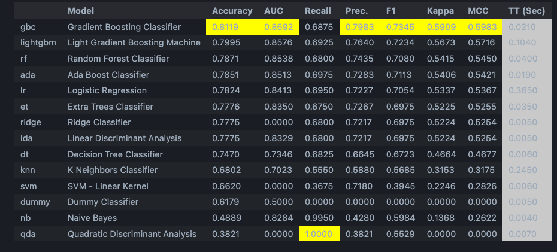
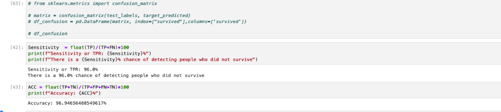

<!-- # Titanic comparison

<h2> Scikit learn </h2>

 -->

# Comparative Analysis of Machine Learning Models for Titanic Dataset

<h3> Introduction </h3>

In the field of machine learning, the Titanic dataset is frequently utilized and provides a great standard for comparing various categorization systems. This paper compares three machine learning models—Pycaret's Gradient Boosting Classifier, Scikit-learn's HistGradient Boosting Classifier, and AWS's XGBoost—that were trained on the Titanic dataset. These models' performances will be assessed and contrasted according to their accuracy criteria. 

<h3> Data overview</h3>

 The Titanic dataset includes passenger characteristics including age, sex, class, and ticket price in addition to the goal variable, which shows whether a passenger survived (1) or not (0).  

<h2>Model Evaluation</h2>

<h3>Pycaret with Gradient Boosting Classifier</h3>

 * Accuracy: <b>83%</b> 

 Using the Titanic dataset, the accuracy of the pycaret model was 83%. This indicates that a fairly high level of predicted accuracy was achieved using the Gradient Boosting Classifier combined with pycaret's automation. 

<h3>Scikit-learn with HistGradientBoostingClassifier</h3>

 * Accuracy: <b>82%</b> 

With the use of the HistGradientBoostingClassifier, the Scikit-learn model attained an 81% accuracy rate. The score is competitive even though it is a little lower than the Pycaret model. 

<h3>AWS with XGBoost</h3>

 * Accuracy: <b>96%</b> 

With an accuracy of 96%, the AWS model that used XGBoost had the best performance. This outstanding performance implies that the Titanic dataset's most accurate predictions were produced using XGBoost in conjunction with AWS's capabilities. 

<h3>Conclusion </h3>

Different levels of accuracy were found when the three models for the Titanic dataset were compared. At 96% accuracy, AWS with XGBoost fared better than the other models. The exceptional precision can be ascribed to the scalability and optimization proficiencies of AWS with XGBoost.

With Gradient Boosting Classifier, Pycaret was able to reach an accuracy of 83%, which is a respectable level of accuracy and highlights the benefits of Pycaret's automation. Scikit-learn with HistGradientBoostingClassifier, on the other hand, obtained an accuracy of 81%, which is marginally less than Pycaret but still competitive. 

The particular use case, available resources, and deployment needs all play a role in selecting the best model. For projects with limited computing resources and a focus on automation, Pycaret and Scikit-learn models can be suitable choices; however, AWS and XGBoost may be the better choice when looking for high accuracy and scalability. 

