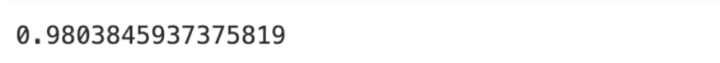
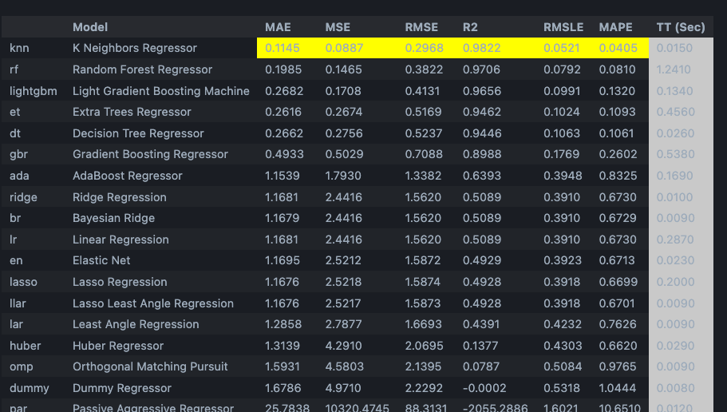

<!-- # Crop comparison

<h2> Scikit learn </h2>

Lineair model

Boosting model
 -->

# Comparative Analysis of Machine Learning Models for Crop Dataset

<h3> Introduction </h3>

The crop dataset is designed for analyzing and understanding crop production, crop type variations, and the relationship between production, land area, and other potential factors. It can be used for various agricultural and economic analyses, including assessing crop yield, trends, and optimization strategies for maximizing production. We used this dataset to train different models and let them predict the prodtuction 

<h3> Data overview</h3>

 The Crop dataset includes characteristics including crop, hectares, production, year and yield

<h2>Model Evaluation</h2>

<h3>Scikit-learn with Linear model</h3>

We can see while the MSE is relatively large, the R2 score of 0.67 suggests that thelinear regression model is performing reasonably well in explaining and predicting a significant portion of the variability in the production values. However, there is still room for improvement, and thats why we will try the boosting also.

<h3>Scikit-learn with Gradient Boosting Regressor</h3>

Here we see the MSE is 122,013,803,657.78 and it has an R2 of 0.99, this indicate that the Gradient Boosting Regressor model is performing exceptionally well in predicting production values. The model's predictions are highly accurate, and it explains a large portion of the variance in the production data. These results suggest that the scikit learn boosting model is a strong predictor for crop production.

<h3>AWS</h3>

We can see the AWS is also performing very well. The R2 is almost as high as the 0,99 of the scikit learn model.

<h3>Pycaret with K Neighbors Regressor</h3>

An R2 of 0.98 suggests that the K Neighbors Regressor model can explain 98% of the variance in the target variable, which is a strong performance.

